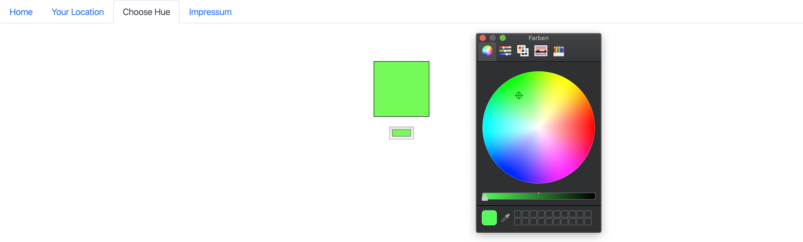

# iLight

iLight wurde entwickelt um selbstständig die Farbwerte des Lichts der Außentemperatur anzupassen. Es lokalisiert ihre Position, gibt ihre Position aus, sowie das aktuelle Wetter. Je nach Temperatur ändert sich der Farbwert des Lichts. Sie möchten wie gewohnt selbst das Licht steuern, so wechseln sie in den anderen Modus und ändern sie den Farbwert selbst.
Das Projekt wurde für alle LED- und Datenfanatiker unter uns gebaut.
Dazu Inspirieren lassen habe ich mich von den Philipps Hue Leuchten, welche noch nicht ihre Farbwerte anhand Wetterdaten ändern.Verwendete Quelle war die API Dokumentation von [OpenWeatherMap](https://openweathermap.org/current).




## Benutzung

1. Um zu starten Laden sie sich das Dokument herunter und öffnen sie den Ordner im Terminal.
```
npm run start
```

2. Öffnen sie anschließend den [http://localhost:9000/](http://localhost:9000/). 
Nutzen sie den Chrome Browser dafür.
Klicken sie auf **Start**.

Nach dem aktuellen Stand leuchtet der LED-Strip nur, da die Farbe "hard gecoded" ist. Daher werden die LED’s noch nicht in der der gewählten Farbe von iLight leuchten.

## Aufbau

**Client Side**
* **index.js:** Importierung von React und verschiedener CSS-Datein für die Schrift und Icons

* **index.html:** HTML-Teil für das das Frontend, greift auf den Container zurück wie die bundle.js

* **components/app.js:** Erstellt React-APP

* **components/weather.js:** Diese Komponente verwendet socket.io-client zur Übergabe von Koordinaten auf der Grundlage Ihrer aktuellen geografischen Position, die Koordinaten werden über die Socket-Verbindung an die Serverseite weitergegeben
  * `displayWeather()`:  
    * Die Wetter-ID wird verwendet, um zu bestimmen, welche Wetterbedingung das CSS-Symbol anzeigen soll
    * Es zeigt auch den Namen, die Beschreibung und die Temperatur des Wetters an
  * `map(val, at_low1, to_high1, at_low2, to_high2)`: Diese Funktion wird in **weather.js** verwendet um die Farbwerte einer Farbtabelle von **npm colormap** zuzuweisen
  
  
  
  
**Server Side**
* **server/index.js:** importiert **socket.io** und gibt es weiter an **routes/index.js:** zum Verbraucher
  * Zudem wird in dieser Datei der Arduino über den **Serialport** angesprochen um den LEDStrip zum leuchten zu bringen
   
* **server/routes/index.js:** empfängt Parameter - Längen- und Breitengrade - über die socket.io-Client- und Serververbindung
  * `getWeather( latitude, longitude, socket )`: Parameter werden zusammen mit einem Socket-Objekt übergeben. Die Funktion ruft eine importierte Wetterfunktion auf, die **openweathermap** api abfragt. Die zurückgegebenen Ergebnisse werden zusammen mit Wetterinformationen im Json-Format an das Wetterereignis ausgegeben      
    
* **server/routes/weather.js:** Greift auf die Wetterdaten von openweather zurück und schickt sie zurück zu weather   


## ToDos

Was noch fehlt, und was die nächsten Schritte wären um es umzusetzen:
* Farbwert an socket.io senden der anschließend den Farbwert weiter gibt in den Ordner **server** zur **index.js** 
* das selbe mit der Funktion **Choose Hue** durchführen
